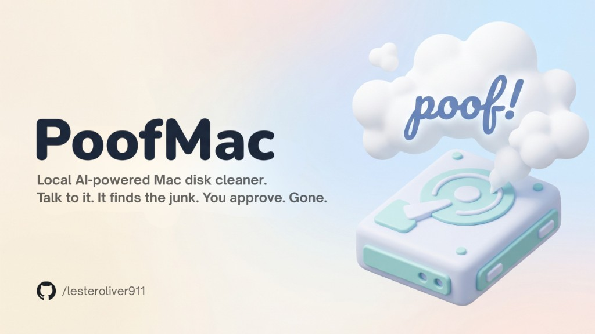

<p align="center">
  
</p>

# PoofMac 💨

**An open-source, AI-powered Mac disk cleaner runs locally, no subscriptions, no surprises.**

I was deep in a coding session when my Mac suddenly threw a "No disk space" warning.
I had no idea where the space had gone. I asked an AI and in minutes it found
gigabytes of Xcode caches, old simulator images, and stale build artifacts I never
knew existed.

PoofMac turns that conversation into a proper tool. It runs a local AI model on your
Mac, analyses your disk, explains exactly what is taking up space in plain English,
and proposes a cleanup plan which *you* review and approve before anything is deleted.

No subscription. No account. No data leaves your machine.

---

## Four interfaces — same backend

| Interface | Command | Best for |
|---|---|---|
| **AI Chat** | `poofmac --chat` | Ask anything in plain English — best starting point |
| **Desktop GUI** | `poofmac` | Daily use, native macOS window |
| **Terminal TUI** | `poofmac --tui` | SSH, headless, developer preference |
| **Non-interactive CLI** | `poofmac --cli` | Scripts, CI, piped output |

---

## Installation

### Quickest — run without installing (like `npx`)

```bash
uvx poofmac --chat
```

Needs [uv](https://docs.astral.sh/uv/) installed once:
```bash
curl -LsSf https://astral.sh/uv/install.sh | sh
```

---

### Install permanently

**With uv (recommended — fast, manages Python automatically)**
```bash
uv tool install poofmac
poofmac --chat
```

**With pip (standard Python)**
```bash
pip install poofmac
poofmac --chat
```

**With the desktop GUI (PySide6)**
```bash
pip install "poofmac[gui]"
poofmac
```


---

### Install from source

```bash
git clone https://github.com/lesteroliver911/poofmac
cd poofmac

# With uv
uv tool install .

# Or with pip
pip install -e .
```

### Configure your model

The first time you run any command, a setup wizard will guide you through
picking an AI provider and saving your API key. No manual `.env` editing needed.

To configure manually:
```bash
cp .env.example .env
# Edit .env — add ANTHROPIC_API_KEY, OLLAMA_API_KEY, etc.
```

---

## Terminal TUI

```
poofmac --tui
```

Full keyboard-driven Textual interface. Identical analysis backend.

---

## Non-interactive CLI

```bash
poofmac --cli                         # scan + show Rich table (no deletions)
poofmac --cli --model gemma4:31b-cloud # override model for this run
poofmac --cli --execute               # delete SAFE items after review
poofmac --cli --json                  # output raw JSON (pipe-friendly)
poofmac --cli --safe-mode             # never delete anything
```

---

## Safety

PoofMac has **two independent safety layers**:

1. **Code-level guardrails** (`safety.py`) — hard-coded path lists that are
   *never* touched, regardless of what the LLM says. No prompt injection
   can bypass Python code.
2. **System prompt** — the LLM is instructed to never propose deleting
   system paths, user data, or anything it isn't certain about.

**Never automatically deleted:**
`/System`, `/usr`, `/bin`, `/etc`, `~/.ssh`, `~/Library/Keychains`,
`~/Documents`, `~/Desktop`, `~/Pictures`, `~/Music`, `~/Movies`, `~/Mail`,
`~/Messages`, `~/Contacts`

**Requires your explicit approval:**
App caches, system logs, Xcode build artifacts, `node_modules`, Python
venvs, Homebrew cache, Trash, and items you select in `~/Downloads`.

---

## Model guide

PoofMac is built around local models — your data stays on your Mac.
The 14–35B parameter range hits the sweet spot of accuracy and speed.

### Ollama local (recommended — runs on your Mac, no API key, no data sent anywhere)

[Install Ollama](https://ollama.com) once, then pull a model:

```bash
ollama pull qwen3.6:35b-a3b   # best overall (MoE — only 3B active, needs ~24 GB RAM)
ollama pull qwen3.6:27b        # dense, excellent tool-calling (~17 GB RAM)
ollama pull qwen2.5:14b        # good for 16 GB Macs (~9 GB RAM)
ollama pull llama3.1:8b        # minimum — 8 GB Mac (~5 GB RAM)
```

| Model | RAM needed | Notes |
|---|---|---|
| `qwen3.6:35b-a3b` | ~24 GB | MoE: only 3B active — best value |
| `qwen3.6:27b` | ~17 GB | Dense, excellent tool-calling |
| `qwen2.5:32b` | ~20 GB | Proven reliable |
| `mistral-small:24b` | ~15 GB | Good for European data |
| `qwen2.5:14b` | ~9 GB | Minimum recommended |
| `llama3.1:8b` | ~5 GB | Absolute minimum (8 GB Mac) |

### Cloud providers (optional — if you already have an API key)

If you have an Anthropic, OpenAI, or OpenRouter account you can point PoofMac
at those too — but it's completely optional. The tool runs fine without any
cloud account.

| Provider | Model | Notes |
|---|---|---|
| Anthropic | `claude-sonnet-4-6` | Strong reasoning, fast |
| Anthropic | `claude-haiku-4-5` | Fastest, lightest cost |
| OpenAI | `gpt-4.1` | Reliable tool-calling |
| OpenRouter | any | One key for many models |

---

## What it finds

| Category | Risk | Notes |
|---|---|---|
| App Caches (`~/Library/Caches`) | SAFE | Rebuilt on next launch |
| System Logs (`~/Library/Logs`) | SAFE | Regenerated by OS |
| Xcode DerivedData | SAFE | Rebuilt when project opens |
| Homebrew Cache | SAFE | Re-downloaded on demand |
| Trash | SAFE | Already deleted by you |
| `node_modules`, `.venv`, `__pycache__` | SAFE | Recreated by build tool |
| iOS / watchOS Simulator Images | SAFE | Re-downloaded from Xcode |
| Large Downloads | CAUTION | Review each item manually |
| Docker images/volumes | CAUTION | `docker system prune` |

---

## Audit log

Every operation is recorded to `~/.poofmac-audit.jsonl`:

```json
{"timestamp": "2026-05-03T14:22:11", "action": "DELETED",
 "path": "/Users/you/Library/Caches/com.apple.dt.Xcode", "size_bytes": 2147483648,
 "note": "User approved deletion via GUI", "_mc": "a4f7b9c2..."}
```

---

## Benchmark

Find the smallest reliable Ollama model for your workload:

```bash
python benchmarks/run_benchmark.py
python benchmarks/run_benchmark.py --fast    # 3 scenarios
python benchmarks/run_benchmark.py --local   # test local models
```

---

## Contributing

See [CONTRIBUTING.md](CONTRIBUTING.md).

---

## Disclaimer

PoofMac is provided **"as is", without warranty of any kind**. See [DISCLAIMER.md](DISCLAIMER.md) for full terms.

**Not affiliated with Apple Inc.** "macOS", "Mac", "Time Machine", and "iCloud" are trademarks of Apple Inc. PoofMac is an independent open-source project.

Always maintain a **current backup** (Time Machine or cloud) before running any cleaning operation. Every deletion requires your explicit confirmation — PoofMac never removes files without your approval.

---

## License

MIT — see [LICENSE](LICENSE).

---

## Author

Built by **[lesteroliver](https://github.com/lesteroliver911)** — developer, maker, and the person who ran out of disk space mid-sprint.

- GitHub: [github.com/lesteroliver911](https://github.com/lesteroliver911)
- LinkedIn: [linkedin.com/in/lesteroliver](https://linkedin.com/in/lesteroliver)

---

*Built for developers who'd rather understand their Mac than pay a monthly fee to clean it.*
